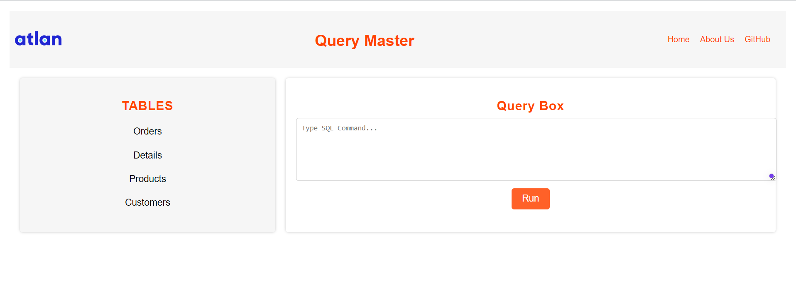
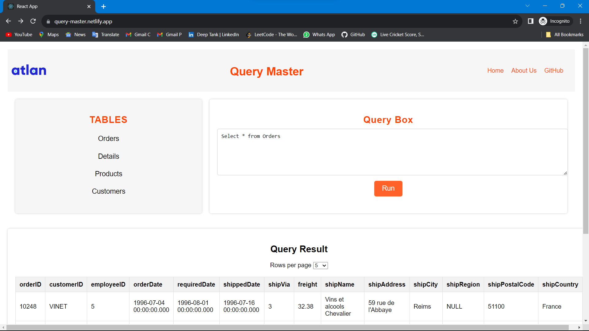
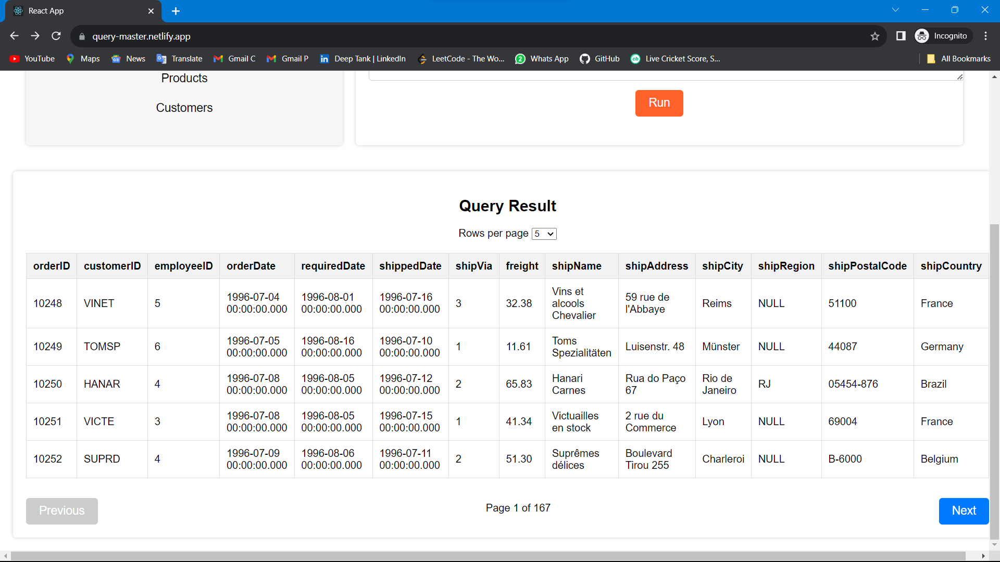

# SQL Editor- Atlan Assignment

**Task:** Create a SQL editor view where your users can query easily on a table using SQL, and see the results.

The app is deployed at: **https://sql-query-app-pavan.netlify.app/**

App fulfills all the requirements that were mentioned by team Atlan.

You can run different queries on the table and view the data of each table.

## Features:

- List of available Task and SQL Editor
- Queries can be run, and the editor can also be cleared.
- As a result, we can view different pages
- Option to change the size of page [5,10,25]
- User can view the table data
- User can run queries

## Major libraries

1. React
2. papaparse
3. React-Ace
4. antd

## Data

I have used CSV files provided by team Atlan and used papaparse to load it anytime a query demands the data to be retrieved from the file.

## Performance

- Using react-ace for code splitting and pre rendering pages for increased performance.
- Lazy loading components like the editor and the table using dynamic imports.

Page Load TIme has been calculated by using the [Lighthouse Tool](https://developers.google.com/web/tools/lighthouse).

# Old Performance

## Steps taken to Optimize

1. Import for `react-ace` editor was a long task running during page load. Converted it to a Lazy loaded component using `React.lazy()` for code-splitting and delaying its loading.
2. The Suspense component handles loading while the components are fetched.
3. The React's React.memo and lazy-loading using React.lazy. React.memo will help prevent unnecessary re-renders of these components when their props haven't changed
4. Only import the used Module in a component from the library rather than importing the whole library.

# After optimiztion, new performance

## User Interface

- I have tried to keep the UI very clean and simple for better user experience.
- The app is fully responsive

## Screenshots

